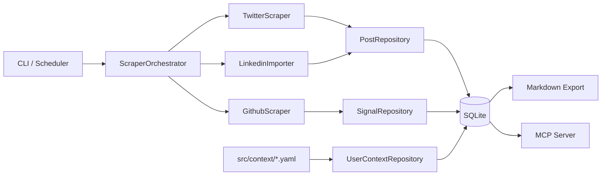
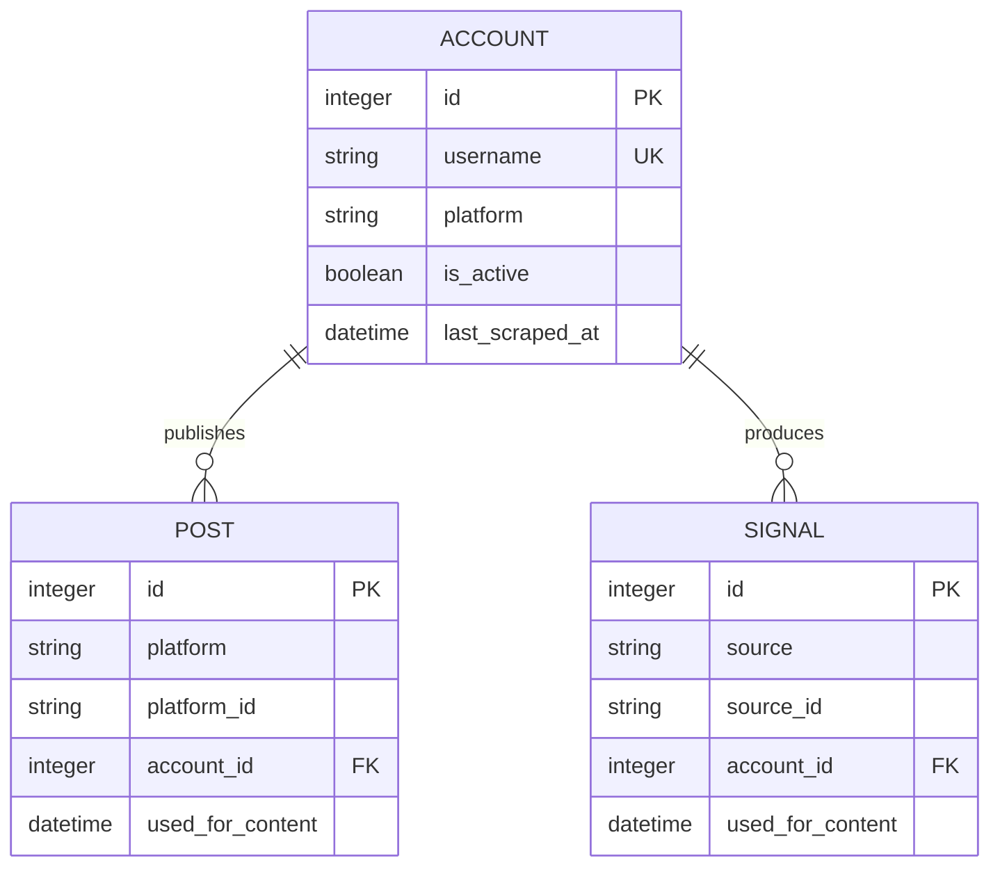

# Architecture

This document is the technical source of truth for EANyra. For setup and daily
usage, start with the repository [README](../README.md). For known defects and
planned changes, see [ROADMAP.md](ROADMAP.md).

## System Purpose

EANyra is a local data pipeline for AI-assisted content creation. It keeps three
types of information together:

1. **Posts**: content already published on a social platform.
2. **Signals**: events or notes that may become future content.
3. **Context**: author voice, platform rules, biography, and active projects.

SQLite is the integration boundary. Collection modules write normalized data;
the export and MCP layers read it without contacting live platforms.

## Runtime Components



### Entry Points

| Entry point | Responsibility |
|---|---|
| `src/core/cli/index.js` | CLI bootstrap, model registration, schema sync, command routing |
| `src/login.js` | Interactive Twitter/X login and persistent session creation |
| `src/core/mcp/server.js` | MCP tool registration and stdio/HTTP transport startup |
| `src/core/cli/import-cookies.js` | Standalone cookie import helper used by `npm run import-cookies -- <file>` |

There is no separate application server. The scheduled daemon is the CLI
process running `Scheduler`.

## Repository Layout

```text
EANyra/
  package.json
  .env.example
  README.md
  docs/
    ARCHITECTURE.md
    CONTEXT_GUIDE.md
    PRODUCT_VISION.md
    ROADMAP.md
    old/                         archived source documents, not authoritative
  skills/eanyra/SKILL.md
  data/                         runtime-only, gitignored
    pot.sqlite
    nyra/                       persistent Playwright profile
    imports/                    LinkedIn CSV files
    exports/                    generated Markdown exports
  src/
    config/
      app.config.js             environment parsing and defaults
      accounts.json.example
    context/
      *.example.yaml
      projects/_template.yaml
    core/
      browser/                  Playwright context and stealth patches
      cli/                      Commander commands
      export/                   Markdown formatter
      mcp/                      MCP server, SQLite queries, tools
      orchestrator/             collection coordination
      scheduler/                cron wrapper
      teapot/                   Sequelize models and repositories
    platforms/
      twitter/
      github/
      linkedin/
    shared/                     logging and generic utilities
```

`teapot` is the project name for the database layer; it is not a separate
service.

## CLI Bootstrap

Every normal CLI command follows this startup sequence:

1. Load environment variables through `dotenv/config`.
2. Resolve configuration in `src/config/app.config.js`.
3. Connect Sequelize to the configured SQLite file.
4. Register all Sequelize models and associations.
5. Run schema synchronization.
6. Parse and execute the Commander command.

Schema synchronization currently uses `sequelize.sync({ alter: true })`. On
SQLite, foreign-key checks are temporarily disabled. If an SQLite constraint
error occurs, startup falls back to `sequelize.sync()` without `alter`.

This makes startup convenient during development but is not a substitute for
versioned migrations.

## Collection Flow

`ScraperOrchestrator.run({ platform? })` coordinates one collection run:

1. Create a `scraper_runs` row with status `running`.
2. Read `src/config/accounts.json` and upsert configured accounts.
3. Load active accounts and optionally filter by platform.
4. Lazily open one persistent browser if Twitter accounts exist.
5. Dispatch each account to its platform module.
6. Persist normalized posts or signals through repositories.
7. Update each successful account's `last_scraped_at`.
8. Close the browser and finalize the run as `success`, `partial`, or `failed`.

The `posts_saved` field in `scraper_runs` is currently used for the total number
of newly persisted records, including GitHub signals.

### Scheduling

`Scheduler` wraps `node-cron`.

- Cron expression: `CRON_SCHEDULE`, default `0 8 * * *`
- Timezone: always UTC
- Optional immediate run: `RUN_ON_STARTUP=true`
- Default CLI behavior with no command: start daemon mode

The scheduler catches run errors so a failed scrape does not stop future cron
ticks.

## Platform Modules

Each platform directory exposes this minimal interface from `index.js`:

```js
export const PLATFORM_ID = 'twitter';
export const displayName = 'Twitter / X';
export function createScraper(/* platform-specific dependencies */) {}
```

The interface is conventional rather than polymorphic: the orchestrator still
contains a `switch` with platform-specific construction and persistence logic.

### Twitter/X

Files:

- `platforms/twitter/TwitterScraper.js`
- `platforms/twitter/humanBehavior.js`
- `core/browser/Browser.js`
- `login.js`

Twitter uses a persistent Playwright Chromium context stored in `data/nyra/`.
The browser wrapper configures viewport, locale, timezone, launch flags,
blocked telemetry domains, and browser API patches.

Collection behavior:

1. Navigate to `https://x.com/<username>`.
2. Wait for tweet article elements.
3. Simulate page landing and human-like scrolling.
4. Extract visible DOM fields into normalized `RawPost` objects.
5. Deduplicate collected results by tweet ID before persistence.

The orchestrator chooses scrape depth:

- no prior Twitter post: `INITIAL_POSTS_PER_ACCOUNT`, default `200`;
- existing Twitter data: `POSTS_PER_ACCOUNT`, default `20`.

DOM extraction currently reads text, date, engagement, media URLs, language,
repost label, and permalink. It is inherently fragile because Twitter/X may
change selectors or abbreviate values.

### GitHub

Files:

- `platforms/github/GithubScraper.js`
- `platforms/github/client.js`

GitHub uses the REST API and requires `GITHUB_TOKEN`. It produces normalized
`RawSignal` objects with `source: "github"`.

Signal types:

| Type | Meaning | Stable ID pattern |
|---|---|---|
| `release` | Recent non-draft release | `release:<owner/repo>:<release-id>` |
| `commit_batch` | Commits grouped by ISO week | `commit_batch:<owner/repo>:<week>` |
| `new_repo` | Repository created in the lookback window | `new_repo:<owner/repo>` |
| `readme_change` | README SHA changed | `readme_change:<owner/repo>:<sha>` |

Repository listing is sorted by most recently pushed and capped by
`GITHUB_REPOS_PER_ACCOUNT`. Releases and commits have separate per-repository
limits.

### LinkedIn

Files:

- `platforms/linkedin/LinkedinImporter.js`
- `platforms/linkedin/csvParser.js`

LinkedIn collection is a local import, not a network scraper. The custom CSV
parser supports quoted fields, escaped quotes, multiline fields, and CRLF/LF
line endings.

`Shares.csv` rows are converted to normalized `RawPost` objects. `Profile.csv`
is optional and only logged. LinkedIn exports do not provide engagement
metrics, so those values are stored as zero or null.

## Persistence Layer

The persistence layer consists of:

- a Sequelize singleton in `core/teapot/database.js`;
- model factories in `core/teapot/models/`;
- repositories in `core/teapot/repositories/`.

### Associations



`UserContext`, `Project`, and `ScraperRun` are standalone models.

### Tables

#### `accounts`

Stores monitored accounts. `username` is globally unique in the current schema,
not unique per platform.

Important fields: `username`, `display_name`, `platform`, `is_active`,
`last_scraped_at`.

#### `posts`

Unified table for published content from all platforms.

Important fields:

- identity: `platform`, `platform_id`, `account_id`;
- content: `text`, `lang`, `posted_at`;
- links/media: `media_urls`, `shared_url`, `raw_url`;
- engagement: `likes`, `reposts`, `replies`, `views`;
- flags: `is_repost`, `is_reply`, `visibility`;
- workflow: `used_for_content`, `scraped_at`.

Deduplication constraint: unique `(platform, platform_id)`.

`PostRepository.saveBatch()` refreshes engagement and scrape timestamps on
duplicates but does not update text, links, flags, or media.

#### `signals`

Unified table for content opportunities and source events.

Important fields:

- identity: `source`, `source_id`, optional `account_id`;
- classification: `signal_type`;
- content: `title`, `body`, `url`, `occurred_at`, JSON `metadata`;
- workflow: `used_for_content`, `scraped_at`.

Deduplication constraint: unique `(source, source_id)`.

#### `scraper_runs`

Audit log for collection runs:

`started_at`, `finished_at`, `status`, `accounts_processed`, `posts_saved`,
`error_message`.

Statuses are `running`, `success`, `partial`, and `failed`.

#### `user_context`

JSON key/value records for `voice`, `bio`, `platforms`, and
`project.<slug>`.

#### `projects`

Structured project metadata: `slug`, `name`, `status`, `description`,
JSON-backed `tech_stack`, `links`, `content_angles`, `posting_rules`, and
`synced_at`.

## Context Sync

`UserContextRepository.sync()` reads:

```text
src/context/voice.yaml
src/context/bio.yaml
src/context/platforms.yaml
src/context/projects/*.yaml
```

Top-level files are upserted into `user_context`. Each project is upserted into
`projects` and duplicated as `user_context` key `project.<slug>` for direct
lookup.

Only active projects are returned by the full context API. The sync is
additive: deleting a YAML file does not remove or archive its existing database
record. Sync is currently explicit through `eanyra context sync`; daemon startup
and scrape commands do not invoke it.

YAML syntax and database constraints are enforced, but there is no complete
context schema validation. Project discovery currently includes any `.yaml`
file not beginning with `_`, which unintentionally includes `.example.yaml`
files. See the [Author Context Guide](CONTEXT_GUIDE.md) for the user-facing
contract and the roadmap for known defects.

## Markdown Export

The `export` CLI command uses:

- `ExportRepository` to query context, posts, and signals;
- `MarkdownExporter` to render one AI-oriented Markdown document.

Default behavior:

- include context, active projects, posts, and signals;
- include all unused records plus recently used records in a 7-day window;
- exclude reposts;
- cap posts and signals at 100 each;
- write to `data/exports/export-<timestamp>.md`;
- mark previously unused included posts and signals with `used_for_content`.

Use `--no-mark` for a read-only export.

## MCP Layer

The MCP layer intentionally uses direct `sqlite3` queries instead of Sequelize.
This keeps the agent-facing process lightweight and independent from CLI
bootstrap/schema synchronization.

Intended tools:

| Tool | Purpose |
|---|---|
| `context_get` | Get all author context or one context key |
| `export_get` | Read the latest generated Markdown export |
| `posts_get` | Query normalized published posts |
| `posts_search` | Search normalized post text |
| `posts_stats` | Aggregate engagement by account/platform |
| `accounts_list` | List monitored accounts and record counts |
| `signals_get` | Query content signals |
| `signals_mark_used` | Mark signals as used |
| `scraper_status` | Read collection run health/history |

Supported transports:

- `stdio`, default, for local MCP clients;
- `http`, Streamable HTTP on `/mcp`, with `/health`.

MCP paths, transport settings, routes, and query defaults come from
`src/config/app.config.js`.

`core/mcp/tools/twitter.js` contains a legacy Twitter-specific API using old
column names. It is not registered by the server.

## Configuration Boundaries

`src/config/app.config.js` is the runtime configuration source of truth. It
parses environment values, applies defaults, and resolves project-relative
paths.

Major configuration objects:

- `PATHS`
- `MCP`
- `SCHEDULER`
- `DB`
- `BROWSER`
- `TWITTER`
- `SCRAPER`
- `EXPORT`
- `GITHUB`
- `LINKEDIN`
- `SUPPORTED_PLATFORMS`

The actual account list is separate in `src/config/accounts.json`.

## Extension Guide

### Add a Publishing Platform

1. Add `src/platforms/<platform>/index.js` and implementation files.
2. Return normalized `RawPost` objects.
3. Add the platform to `SUPPORTED_PLATFORMS` in `config/app.config.js`.
4. Add an orchestrator branch that persists through `PostRepository`.
5. Extend MCP platform enums where required.
6. Add examples, tests, and documentation.

### Add a Signal Source

1. Build an importer or collector that returns normalized `RawSignal` objects.
2. Persist through `SignalRepository`.
3. Add source-specific metadata conventions.
4. Extend export presentation if the new type benefits from special rendering.

### Add an MCP Tool

1. Add a tool definition under `core/mcp/tools/`.
2. Export it in an array with `name`, `description`, `inputSchema`, and
   `handler`.
3. Register the array in `core/mcp/server.js`.
4. Keep SQL parameterized.
5. Add integration tests against a disposable SQLite fixture.

## Operational Constraints

- Runtime data and real context files are gitignored.
- Twitter/X scraping depends on an authenticated persistent browser session.
- GitHub collection depends on API rate limits and token access.
- LinkedIn import depends on the shape of LinkedIn's export files.
- SQLite is local and single-host; there is no distributed locking.
- Automated tests and migrations are not currently present.
- Several confirmed defects are tracked in [ROADMAP.md](ROADMAP.md).
